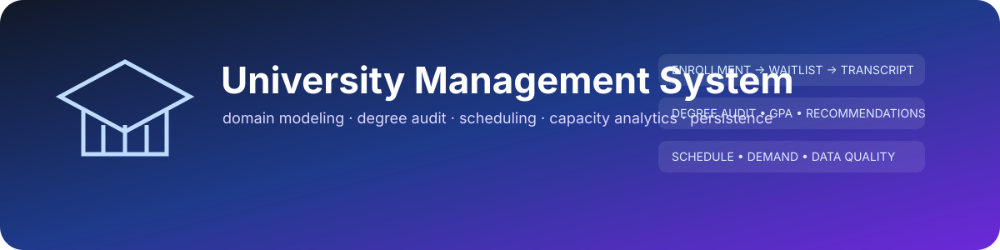

<div align="center">
  

  [](https://github.com/shiv814/university-management-system/actions/workflows/build.yml)
  
  
  

  **A dependency-free Java academic-record platform modeling enrollment lifecycles, prerequisite rules, waitlists, transcripts, degree progress, timetable optimization, demand analytics, data quality and durable persistence.**
</div>

---

## Engineering story

The original project was a small object-oriented roster exercise. It has been deliberately evolved into a richer domain model where the interesting work is not displaying a list of students—it is preserving invariants across enrollment state, capacity, prerequisites, completion, waitlist promotion, persistence and derived academic analytics.

Version 3 adds planning and analytics as **read-only layers around the stateful core**, making the architecture easier to reason about and test.

## Capability map

| Area | What the project models |
|---|---|
| Student records | validated identifiers, email, program and year level |
| Course catalog | credits, term, capacity and prerequisite sets |
| Enrollment lifecycle | enrolled, waitlisted, completed and dropped states |
| Capacity | FIFO waitlists and automatic seat promotion |
| Academic records | transcript entries, earned/attempted credits and weighted GPA |
| Recommendations | prerequisite-aware eligible next courses |
| Degree audit | total-credit progress, requirement groups, in-progress credits and standing signal |
| Scheduling | section meetings, conflict detection and deterministic timetable optimization |
| Capacity intelligence | fill rate, waitlist pressure and bottleneck ranking |
| Data quality | missing prerequisites, cycles, orphan references and duplicate-email checks |
| Reporting | standalone responsive HTML portfolio dashboard |
| Persistence | correctly escaped CSV save/load with lifecycle restoration |

## Architecture

```mermaid
flowchart LR
  CLI[CLI] --> SERVICE[UniversityService]
  SERVICE --> MODEL[Domain records]
  SERVICE --> STORE[CSV store]
  SERVICE --> TRANSCRIPT[Transcript]
  SERVICE --> RECS[Recommendations]
  SERVICE --> AUDIT[Degree audit]
  SERVICE --> ANALYTICS[Demand analytics]
  SERVICE --> QUALITY[Data quality]
  SECTIONS[Section meetings] --> SCHEDULE[Schedule planner]
  AUDIT --> REPORT[HTML report]
  ANALYTICS --> REPORT
  QUALITY --> REPORT
```



## Quick start

```bash
git clone https://github.com/shiv814/university-management-system.git
cd university-management-system
python scripts/test.py
```

That single command compiles production code with `javac -Xlint:all -Werror`, compiles both test runners, executes the original domain tests, executes the v3 advanced tests, runs the end-to-end demo, and verifies the generated HTML report.

## Degree audit

`DegreeAuditEngine` combines the existing transcript and recommendation APIs with an explicit `DegreeProgram` model. It reports completed/in-progress credits, requirement-group progress, completion percentage, eligible next courses and a documented portfolio-only academic standing signal.

```java
DegreeProgram program = new DegreeProgram(
    "CENG",
    "Computer Engineering",
    20.0,
    List.of(new DegreeProgram.RequirementGroup(
        "Digital systems", 1.0, 2, Set.of("ENGG2410", "ENGG3380")
    ))
);
var audit = new DegreeAuditEngine().audit(service, "1001", program);
```

## Timetable optimization

`SchedulePlanner` uses deterministic backtracking to choose one conflict-free section per requested course. Complete schedules are scored by number of campus days, gaps between meetings, and very early/late meeting penalties. The scoring model is transparent and intentionally customizable.

## Enrollment analytics

The analytics layer calculates active-seat fill rate, waitlist pressure, total demand and a pressure band per course, then ranks likely bottlenecks. Because it only consumes public service snapshots, it cannot accidentally mutate enrollment state.

## Data integrity

`DataQualityAuditor` walks the current service snapshot and flags missing prerequisite references, prerequisite cycles, orphan enrollments and duplicate emails. This complements the core write-time validation with a portfolio-style operational audit.

## Generated portfolio report

`V3Demo` creates `build/portfolio-report.html`, a dependency-free dark-mode dashboard with live values from the sample domain model: student/course counts, active seats, waitlists, degree progress, requirement bars, capacity bottlenecks and data-quality status.

## Repository map

```text
src/main/java/ca/shivam/university/
  UniversityService.java      stateful enrollment/domain service
  CsvStore.java               durable CSV persistence
  DegreeProgram.java          immutable degree requirements
  DegreeAuditEngine.java      academic progress calculation
  CourseSection.java          timetable meeting model
  SchedulePlanner.java        conflict-free schedule search
  EnrollmentAnalytics.java    demand and capacity metrics
  DataQualityAuditor.java     catalog/relationship validation
  UniversityReport.java       standalone HTML renderer
  V3Demo.java                 reproducible portfolio demo
src/test/...                   original + advanced test runners
scripts/test.py                cross-platform compile/test/demo pipeline
docs/                          architecture, models and integrity notes
```

## Verification matrix

GitHub Actions runs Java 17 and Java 21 on Linux, Windows and macOS. Every job compiles with all javac lint warnings enabled and treated as errors, executes both test runners, runs the v3 demo, and validates that the HTML artifact was produced.

## Design decisions and boundaries

- no third-party runtime libraries: collection design, persistence and algorithms remain visible
- analytics/reporting are separate from mutable enrollment commands
- v3 degree/standing rules are demonstration models, **not official University of Guelph policy**
- timetable scoring expresses one transparent preference function rather than pretending there is a universal “best” schedule
- CSV is appropriate for a local portfolio project; a multi-user deployment would move persistence and concurrency into a transactional database/service layer

## Documentation

- [Architecture](docs/ARCHITECTURE.md)
- [Academic models](docs/ACADEMIC_MODELS.md)
- [Data integrity](docs/DATA_INTEGRITY.md)
- [Contributing](CONTRIBUTING.md)

## License
MIT © Shivam Patel
