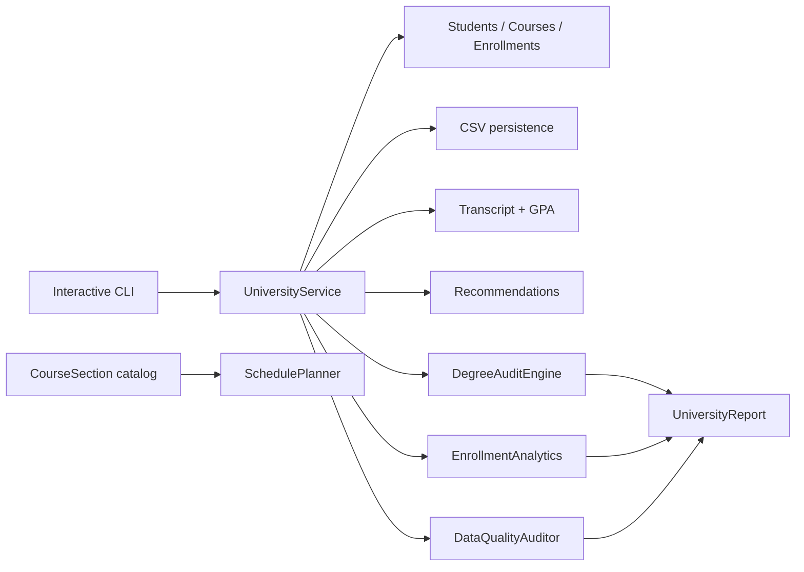

# Architecture

The core service owns mutable enrollment state. Version 3 deliberately keeps degree audits, capacity analytics, schedule optimization, data-quality checks and report rendering outside that stateful core. That separation makes analytical features easier to test and prevents a dashboard calculation from changing academic records.

## Persistence boundary

`CsvStore` remains the persistence adapter for students, courses and enrollment lifecycle records. New v3 analysis models are derived views and therefore do not require a schema migration.
